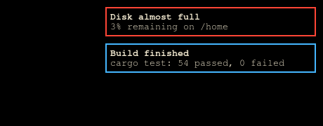
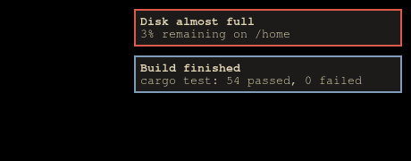

# Acid for mako

Two flavours: **Acetic** (`#000000`), vibrant, and **Citric** (`#1c1b19`), muted.

Part of [Acid](https://github.com/acid-theme/acid), a very dark colourscheme in two
flavours. The main README lists the other ports.

## Preview

| Acetic | Citric |
| --- | --- |
|  |  |

## Install

```sh
curl -fsSLo ~/.config/mako/acid-acetic.conf \
  https://raw.githubusercontent.com/acid-theme/mako/main/acid-acetic.conf
```

`include` needs an absolute or `~/`-prefixed path:

```ini
include=~/.config/mako/acid-acetic.conf

# Local settings. mako takes the last matching value, so anything below the
# include wins.
font=monospace 10
padding=6
border-size=1
```

Sets the defaults plus `[urgency=low]`, `[urgency=normal]`, `[urgency=high]` and
`[hidden]`. Those sections do not leak into the including file.

## Files

- `acid-acetic.conf`
- `acid-citric.conf`

## Generated

Acid 0.1.0, rendered by acidify from
[`ports/mako/acid.conf.tera`](https://github.com/acid-theme/acid/blob/main/ports/mako/acid.conf.tera).
Edits to these files are overwritten on the next release. Report issues on
[acid-theme/acid](https://github.com/acid-theme/acid/issues).

## Licence

MIT.
